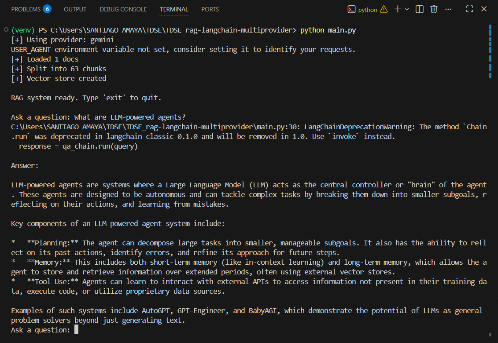

# TDSE - RAG System with LangChain (Multi-Provider: Gemini / OpenAI)

Student Name: Santiago Amaya Zapata

## Project Overview

This repository implements a **Retrieval-Augmented Generation (RAG)** system using LangChain.

The system:

- Loads a web document
- Splits it into semantic chunks
- Converts chunks into embeddings
- Stores them in a vector database (Chroma)
- Retrieves relevant context based on user queries
- Generates an answer using a Large Language Model (LLM)

Unlike a basic chatbot, this system does **grounded generation**, meaning responses are based on retrieved documents instead of relying only on the model’s internal knowledge.

The project supports **multiple providers**:

- Google Gemini (free tier)
- OpenAI (optional)

The provider is selected automatically depending on the API key found in the environment variables.

---

# System Architecture

## High-Level Architecture

User Question  
↓  
Retriever (Vector Search - Chroma)  
↓  
Relevant Document Chunks  
↓  
LLM (Gemini or OpenAI)  
↓  
Final Answer  

---

## Core Components

### 1. Document Loader
- Uses `WebBaseLoader`
- Downloads content from:
  https://lilianweng.github.io/posts/2023-06-23-agent/

### 2. Text Splitter
- `RecursiveCharacterTextSplitter`
- Chunk size: 1000 characters
- Overlap: 200 characters
- Ensures semantic continuity

### 3. Embeddings
Depending on provider:

- OpenAI → `text-embedding-3-large`
- Gemini → `gemini-embedding-001`

Embeddings transform text into dense vectors for similarity search.

### 4. Vector Database
- Uses **Chroma**
- Runs locally
- No external service required
- Stores embeddings for fast similarity search

### 5. Retriever
- Converts user query into vector
- Performs similarity search
- Returns most relevant document chunks

### 6. LLM (Language Model)

Provider is selected automatically:

- If `OPENAI_API_KEY` is found → OpenAI is used
- If `GOOGLE_API_KEY` is found → Gemini is used

Models used:
- OpenAI → `gpt-4o-mini`
- Gemini → `gemini-2.5-flash-lite`

### 7. RetrievalQA Chain
LangChain’s `RetrievalQA` combines:
- Retrieved context
- User question
- LLM generation

This forms the complete RAG pipeline.

---

# Project Structure


rag-langchain-multiprovider/

│
├── main.py

├── config.py

├── ingest.py

├── .gitignore

├── retrieval_chain.py

├── requirements.txt

└── .env.example


---

# Installation Guide

## Step 1 — Clone Repository

```bash
git clone https://github.com/SantiagoAmaya21/TDSE_rag-langchain-multiprovider.git
cd TDSE_rag-langchain-multiprovider
```

## Step 2 — Create Virtual Environment

Mac / Linux

```bash
python -m venv venv
source venv/bin/activate
```

Windows

```bash
python -m venv venv
venv\Scripts\activate
```

## Step 3 — Install Dependencies

```bash
pip install -r requirements.txt
```

## Step 4 — Configure Environment Variables

Create a .env file:

Option A — Use Gemini (Recommended - Free Tier)
GOOGLE_API_KEY=your_real_gemini_key

Option B — Use OpenAI
OPENAI_API_KEY=your_real_openai_key

Only one key is required.

Running the Project

```bash
python main.py
```

You will see:

[+] Using provider: gemini
[+] Loaded 1 docs
[+] Split into 120 chunks
[+] Vector store created

RAG system ready. Type 'exit' to quit.

Example Execution



---

## Technical Highlights

Multi-provider architecture

Local vector database (Chroma)

Automatic API detection

Modular file separation

Clean LangChain pipeline

Reproducible setup

No mandatory paid services

## Technologies Used

Python

LangChain

ChromaDB

Google Gemini API

OpenAI API

BeautifulSoup

dotenv

## Conclusion

This project demonstrates a complete implementation of a Retrieval-Augmented Generation system using LangChain with a flexible multi-provider architecture.

It shows understanding of:

Embeddings

Vector databases

Retrieval pipelines

LLM integration

Modular system design

The system is fully functional, reproducible, and ready for academic evaluation.


---
